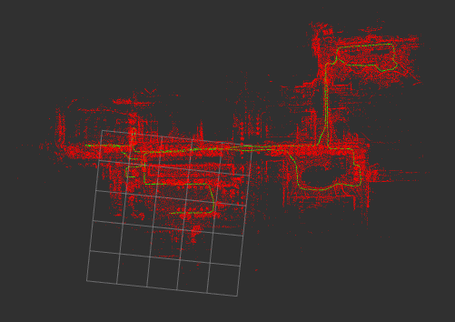

# pcl_localization_ros2
  
A ROS2 package of 3D LIDAR-based Localization using PCL.



Green: path, Red: map  
(the 5x5 grids in size of 50m × 50m)

## IO
- input  
/cloud  (sensor_msgs/PointCloud2)  
/map  (sensor_msgs/PointCloud2)  
/initialpose (geometry_msgs/PoseStamed)(when `set_initial_pose` is false)  
/odom (nav_msgs/Odometry)(optional)   
/imu  (sensor_msgs/Imu)(optional)  

- output  
/pcl_pose (geometry_msgs/PoseStamped)  
/path (nav_msgs/Path)  
/initial_map (sensor_msgs/PointCloud2)(when `use_pcd_map` is true)  

## params

|Name|Type|Default value|Description|
|---|---|---|---|
|registration_method|string|"NDT"|"NDT" or "GICP"|
|ndt_resolution|double|2.0|resolution size of voxels[m]|
|ndt_step_size|double|0.1|step_size maximum step length[m]|
|transform_epsilon|double|0.01|transform epsilon to stop iteration in registration|
|voxel_leaf_size|double|0.2|down sample size of input cloud[m]|
|scan_max_range|double|100.0|max range of input cloud[m]|
|scan_min_range|double|1.0|min range of input cloud[m]|
|scan_periad|double|0.1|scan period of input cloud[sec]|
|use_pcd_map|bool|false|whether pcd_map is used or not|
|map_path|string|"/map/map.pcd"|pcd_map file path|
|set_initial_pose|bool|false|whether or not to set the default value in the param file|
|initial_pose_x|double|0.0|x-coordinate of the initial pose value[m]|
|initial_pose_y|double|0.0|y-coordinate of the initial pose value[m]|
|initial_pose_z|double|0.0|z-coordinate of the initial pose value[m]|
|initial_pose_qx|double|0.0|Quaternion x of the initial pose value|
|initial_pose_qy|double|0.0|Quaternion y of the initial pose value|
|initial_pose_qz|double|0.0|Quaternion z of the initial pose value|
|initial_pose_qw|double|1.0|Quaternion w of the initial pose value|
|use_odom|bool|false|whether odom is used or not for initial attitude in point cloud registration|
|use_imu|bool|false|whether 9-axis imu is used or not for point cloud distortion correction|
|enable_debug|bool|false|whether debug is done or not|

## demo

demo data(ROS1) by Tier IV  
https://data.tier4.jp/rosbag_details/?id=212  
The Velodyne VLP-16 was used in this data.

Before running, put `bin_tc-2017-10-15-ndmap.pcd` into your `map` directory and  
edit the `map_path` parameter of `localization.yaml` in the `param` directory accordingly.
```
rviz2 -d src/pcl_localization_ros2/rviz/localization.rviz
ros2 launch pcl_localization_ros2 pcl_localization.launch.py
ros2 bag play -s rosbag_v2 tc_2017-10-15-15-34-02_free_download.bag
```


Green: path, Red: map  
(the 5x5 grids in size of 50m × 50m)