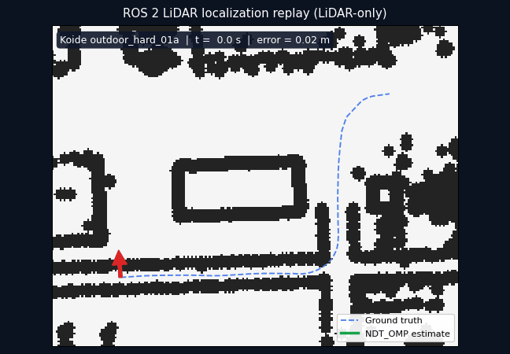
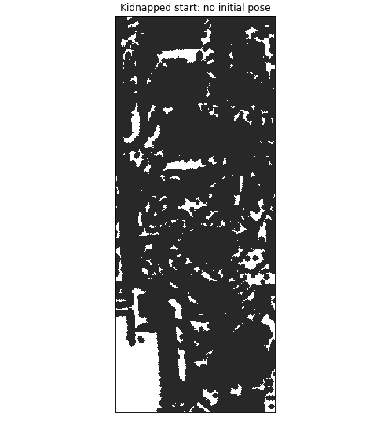

<div align="center">

<h1>lidar_localization_ros2</h1>

<p><strong>Map-based 3D LiDAR localization for ROS 2 and Nav2.</strong></p>

<p>
  <a href="https://github.com/rsasaki0109/lidar_localization_ros2/actions/workflows/main.yml">
    
  </a>
  
  
  
</p>

<table>
  <tr>
    <td align="center"><strong>Guarded LiDAR + IMU localization</strong></td>
    <td align="center"><strong>Kidnapped-start global relocalization</strong></td>
  </tr>
  <tr>
    <td></td>
    <td></td>
  </tr>
  <tr>
    <td align="center"><sub>Koide outdoor_kidnap_a · NDT_OMP + guarded IMU preintegration</sub></td>
    <td align="center"><sub>No initial pose · BBS_2D candidates · NDT tracking resumes</sub></td>
  </tr>
</table>

<p><a href="./docs/koide_gif_gallery.md">Explore the complete Koide indoor/outdoor GIF gallery →</a></p>

</div>

## Overview

This package provides:

- NDT/GICP-based localization against `.pcd` or `.ply` maps
- standalone and Nav2 launch files
- optional odometry and IMU prediction
- alignment diagnostics and guarded reinitialization signals
- repeatable rosbag benchmark tools

New users should start with ROS 2 Jazzy and the default NDT_OMP backend. Experimental
deskew and global-localization features are off by default. See
[docs/v1_status.md](docs/v1_status.md) for the validated scope and limitations.

## Install

Expected workspace layout:

```text
lidarloc_ws/src/
  lidar_localization_ros2/
  ndt_omp_ros2/
```

Bootstrap and build:

```bash
mkdir -p ~/lidarloc_ws/src
cd ~/lidarloc_ws/src
git clone https://github.com/rsasaki0109/lidar_localization_ros2.git
cd lidar_localization_ros2
scripts/bootstrap_colcon_workspace.sh --build
source ~/lidarloc_ws/install/setup.bash
```

Manual build:

```bash
cd ~/lidarloc_ws
vcs import src < src/lidar_localization_ros2/dependencies.repos
source /opt/ros/${ROS_DISTRO:-jazzy}/setup.bash
colcon build --symlink-install --packages-up-to lidar_localization_ros2
source install/setup.bash
```

See [docs/local_build.md](docs/local_build.md) for the no-sudo local-prefix workflow.

## Quick Start

Generate a small configuration file:

```bash
ros2 run lidar_localization_ros2 create_lidar_localization_config.py \
  --profile standalone \
  --map-path /absolute/path/to/map.pcd \
  --output /tmp/lidar_localization.yaml
```

The generator prints the matching launch and bringup-check commands. For rosbag replay,
add `--use-sim-time`. Add `--initial-pose X Y Z QX QY QZ QW` when the map pose is known.

Common launches:

```bash
# LiDAR localization
ros2 launch lidar_localization_ros2 nav2_lidar_localization.launch.py

# Full Nav2 wrapper
ros2 launch lidar_localization_ros2 nav2_navigation.launch.py \
  map_yaml:=/absolute/path/to/map.yaml

# Livox MID-360 preset
ros2 launch lidar_localization_ros2 mid360_legged_localization.launch.py \
  map_path:=/absolute/path/to/map.pcd \
  cloud_topic:=/livox/points \
  imu_topic:=/livox/imu
```

Check topics, TF, pose output, and diagnostics before tuning registration:

```bash
ros2 run lidar_localization_ros2 check_lidar_localization_bringup.py \
  --profile standalone
```

## Public Demo

The Autoware Istanbul demo downloads its public assets, builds the package when needed,
replays 60 seconds, and writes a trajectory report:

```bash
source scripts/setup_local_env.sh
scripts/run_public_demo.sh
```

First-time setup usually takes 15–30 minutes because of downloads. Results vary between
runs; use the regression suite for release decisions:

```bash
source scripts/setup_local_env.sh
scripts/run_public_regression_suite.sh
```

See [docs/benchmarking.md](docs/benchmarking.md) for datasets, metrics, and variance notes.

## Frame Contract

Default frames are `map`, `odom`, and `base_link`.

- `/initialpose` must be expressed in `map`.
- Default mode publishes `map -> base_link`.
- Nav2 mode publishes `map -> odom` and requires external `odom -> base_link`.
- `use_odom: true` consumes the `/odom` topic for prediction; it does not create odom TF.
- Do not publish the same static LiDAR or IMU transform from two nodes.

See [docs/frame_contract.md](docs/frame_contract.md) for the complete contract and
[docs/troubleshooting.md](docs/troubleshooting.md) when poses do not update.

## Nav2 Inputs

Full Nav2 operation requires:

- a 3D pointcloud map for localization
- a 2D occupancy map YAML for planning
- an `odom -> base_link` source
- an initial pose in the `map` frame

Generate a 2D map from a pointcloud with
`generate_occupancy_map_from_pcd.py`; usage is documented in
[docs/benchmarking.md](docs/benchmarking.md).

## Main Interfaces

| Direction | Topic | Type |
|---|---|---|
| Input | `/cloud` | `sensor_msgs/msg/PointCloud2` |
| Input | `/initialpose` | `geometry_msgs/msg/PoseWithCovarianceStamped` |
| Input | `/odom` | `nav_msgs/msg/Odometry` |
| Input | `/imu` | `sensor_msgs/msg/Imu` |
| Output | `/pcl_pose` | `geometry_msgs/msg/PoseStamped` |
| Output | `/path` | `nav_msgs/msg/Path` |
| Output | `/alignment_status` | `diagnostic_msgs/msg/DiagnosticArray` |
| Output | `/reinitialization_requested` | `std_msgs/msg/Bool` |

Topic names are configurable. Runtime map paths accept `.pcd` and `.ply`.

## Experimental Features

- Continuous-time deskew and IMU pose-history variants are default-off.
- Global localization is an opt-in BBS_2D service and is not part of normal launch.
- Hessian localizability diagnostics are default-off and are too expensive for normal runtime.
- Automatic recovery requires explicit supervisor safety gates.

Read [docs/imu_estimation.md](docs/imu_estimation.md) and
[docs/global_localization.md](docs/global_localization.md) before enabling these paths.

## Validation

```bash
source scripts/setup_local_env.sh
cd ../build_ws
colcon build --symlink-install --packages-up-to lidar_localization_ros2

ros2 run lidar_localization_ros2 run_experiment_suite.py
ros2 run lidar_localization_ros2 run_release_regression_suite.sh
```

Public replay validation does not replace sensor-specific or real-robot testing.

## Documentation

| Need | Document |
|---|---|
| Validated scope | [v1 status](docs/v1_status.md) |
| Build and benchmarks | [local build](docs/local_build.md), [benchmarking](docs/benchmarking.md) |
| Frames and troubleshooting | [frame contract](docs/frame_contract.md), [troubleshooting](docs/troubleshooting.md) |
| Nav2/MID-360 | [MID-360 bringup](docs/mid360_legged_jetson.md) |
| IMU and covariance | [IMU estimation](docs/imu_estimation.md), [pose covariance](docs/pose_covariance.md) |
| Relocalization | [global localization](docs/global_localization.md), [v1.1 relocalization](docs/v1_1_relocalization.md) |
| Plans and decisions | [development plan](docs/development_plan.md), [decisions](docs/decisions.md) |

## Support

ROS 2 Jazzy is the primary target; Humble remains supported for existing deployments.
Required dependency: [ndt_omp_ros2](https://github.com/rsasaki0109/ndt_omp_ros2).
[small_gicp](https://github.com/koide3/small_gicp) is optional.

See [CHANGELOG.md](CHANGELOG.md) for release notes.
