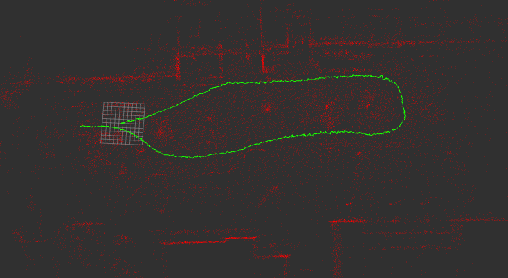

# lidar_localization_ros2
A ROS2 package of 3D LIDAR-based Localization.



Green: path, Red: map  
(the 5x5 grids in size of 50m × 50m)

## Requirements

- [ndt_omp_ros2](https://github.com/rsasaki0109/ndt_omp_ros2.git)
- [small_gicp](https://github.com/koide3/small_gicp) (optional, for `SMALL_GICP` and `SMALL_VGICP`)

If `small_gicp` is installed as a CMake package at build time, `SMALL_GICP` and `SMALL_VGICP`
are enabled automatically.

## local build

For the no-sudo local prefix workflow used in this workspace, see [docs/local_build.md](docs/local_build.md).
After the first successful build, load the environment with:

```bash
source scripts/setup_local_env.sh
```

## IO
- input  
/cloud  (sensor_msgs/PointCloud2)  
/map  (sensor_msgs/PointCloud2)  
/initialpose (geometry_msgs/PoseStamed)(when `set_initial_pose` is false)  
/odom (nav_msgs/Odometry)(optional)   
/imu  (sensor_msgs/Imu)(optional)  

- output  
/pcl_pose (geometry_msgs/PoseStamped)  
/path (nav_msgs/Path)  
/alignment_status (diagnostic_msgs/DiagnosticArray)  
/initial_map (sensor_msgs/PointCloud2)(when `use_pcd_map` is true)  

## params

|Name|Type|Default value|Description|
|---|---|---|---|
|registration_method|string|"NDT_OMP"|"NDT" or "GICP" or "NDT_OMP" or "GICP_OMP" or "SMALL_GICP" or "SMALL_VGICP"|
|score_threshold|double|2.0|maximum accepted registration fitness score|
|ndt_resolution|double|2.0|resolution size of voxels[m]|
|ndt_step_size|double|0.1|step_size maximum step length[m]|
|ndt_num_threads|int|4|threads using NDT_OMP(if `0` is set, maximum alloawble threads are used.)|
|gicp_corr_randomness|int|20|number of neighbors for GICP covariance estimation|
|gicp_max_correspondence_distance|double|2.0|max correspondence distance for GICP-family backends[m]|
|vgicp_voxel_resolution|double|1.0|voxel resolution for `SMALL_VGICP`[m]|
|transform_epsilon|double|0.01|transform epsilon to stop iteration in registration|
|voxel_leaf_size|double|0.2|down sample size of input cloud[m]|
|scan_max_range|double|100.0|max range of input cloud[m]|
|scan_min_range|double|1.0|min range of input cloud[m]|
|scan_periad|double|0.1|scan period of input cloud[sec]|
|use_pcd_map|bool|false|whether pcd_map is used or not|
|map_path|string|"/map/map.pcd"|pcd_map or ply_map file path|
|set_initial_pose|bool|false|whether or not to set the default value in the param file|
|initial_pose_x|double|0.0|x-coordinate of the initial pose value[m]|
|initial_pose_y|double|0.0|y-coordinate of the initial pose value[m]|
|initial_pose_z|double|0.0|z-coordinate of the initial pose value[m]|
|initial_pose_qx|double|0.0|Quaternion x of the initial pose value|
|initial_pose_qy|double|0.0|Quaternion y of the initial pose value|
|initial_pose_qz|double|0.0|Quaternion z of the initial pose value|
|initial_pose_qw|double|1.0|Quaternion w of the initial pose value|
|use_odom|bool|false|whether odom is used or not for initial attitude in point cloud registration|
|use_twist_prediction|bool|false|use a `geometry_msgs/msg/TwistWithCovarianceStamped` topic to advance the registration initial guess between accepted pose updates|
|twist_prediction_use_angular_velocity|bool|true|apply angular velocity as well as linear velocity during twist-based prediction|
|max_twist_prediction_dt|double|0.5|maximum time span integrated in one twist-based prediction step[sec]|
|use_imu|bool|false|whether 9-axis imu is used or not for point cloud distortion correction|
|enable_debug|bool|false|whether debug is done or not|
|predict_pose_from_previous_delta|bool|true|use the previous accepted pose delta as the next registration initial guess|
|reject_above_score_threshold|bool|true|skip pose updates when `fitness_score` exceeds `score_threshold`|
|enable_timer_publishing|bool|false|if true, publish tf and pose on a set timer frequency|
|pose_publish_frequency|double|10.0|publishing frequency if enable_timer_publishing is true|

## demo

demo data(ROS1) by Tier IV（The link has changed and is now broken.)  
https://data.tier4.jp/rosbag_details/?id=212  
To use ros1 rosbag , use [rosbags](https://pypi.org/project/rosbags/).  
The Velodyne VLP-16 was used in this data.

Before running, put `bin_tc-2017-10-15-ndmap.pcd` into your `map` directory and  
edit the `map_path` parameter of `localization.yaml` in the `param` directory accordingly.
```
rviz2 -d src/lidar_localization_ros2/rviz/localization.rviz
ros2 launch lidar_localization_ros2 lidar_localization.launch.py
ros2 bag play tc_2017-10-15-15-34-02_free_download/
```


Green: path, Red: map  
(the 5x5 grids in size of 50m × 50m)

## roadmap

See [docs/competitive_roadmap.md](docs/competitive_roadmap.md) for a competitor analysis and a prioritized roadmap against Autoware, hdl_localization, and small_gicp/GLIM-class systems.

## benchmarking

See [docs/benchmarking.md](docs/benchmarking.md) for the built-in rosbag benchmark harness and trajectory evaluation flow.

For a reproducible real dataset, fetch the official `hdl_localization` sample with:

```bash
source scripts/setup_local_env.sh
scripts/fetch_official_hdl_localization_sample.sh
```

This prepares `hdl_400.bag`, `map.pcd`, and a filtered `rosbag2` copy under `data/official/hdl_localization`.

For any public or externally shared benchmark result, use this official `hdl_localization` sample.
Do not publish results based on private local field logs or graph-derived synthetic bags as if they were open datasets.

For a stronger public `map-based lidar localization` benchmark, fetch the official Autoware Istanbul localization dataset with:

```bash
source scripts/setup_local_env.sh
scripts/fetch_official_autoware_istanbul_dataset.sh
```

This prepares `pointcloud_map.pcd` and a `localization_rosbag` directory under `data/official/autoware_istanbul`.

Use `ros2 run lidar_localization_ros2 benchmark_extract_pose_reference_from_rosbag2 ...` to extract
the GNSS reference trajectory directly from the bag instead of recording it through replay.
When testing twist-aided prediction on this dataset, launch with
`twist_topic:=/localization/twist_estimator/twist_with_covariance`.
The sweep helper also supports this via
`--twist-topic /localization/twist_estimator/twist_with_covariance`.
