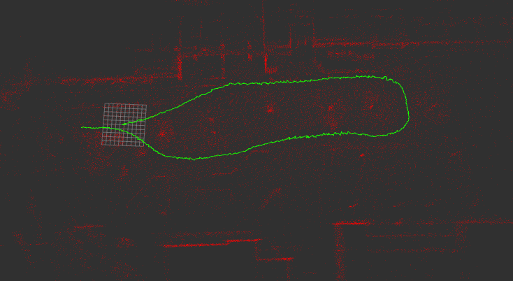

<div align="center">

<h1>lidar_localization_ros2</h1>

<p><strong>Map-based 3D LiDAR localization for ROS 2 and Nav2.</strong></p>

<p>
  <a href="https://github.com/rsasaki0109/lidar_localization_ros2/actions/workflows/main.yml">
    
  </a>
  
  
  
</p>



<p><a href="./docs/koide_gif_gallery.md">Explore the complete Koide indoor/outdoor GIF gallery →</a></p>

</div>

## Features

- NDT/GICP localization against `.pcd` and `.ply` maps
- standalone, Nav2, and Livox MID-360 launch configurations
- odometry/IMU prediction, scan deskew, diagnostics, and guarded recovery
- rosbag demo and regression tools

ROS 2 Jazzy with NDT_OMP is the recommended starting point. Continuous-time deskew is
enabled by default and safely leaves scans unchanged until point timing and motion data
are ready. Guarded global initialization is enabled automatically when quickstart is
given a matching occupancy map. See [v1 status](docs/v1_status.md) for validated scope
and limitations.

## Install

```bash
mkdir -p ~/lidarloc_ws/src
cd ~/lidarloc_ws/src
git clone https://github.com/rsasaki0109/lidar_localization_ros2.git
cd lidar_localization_ros2
scripts/bootstrap_colcon_workspace.sh --build
source ~/lidarloc_ws/install/setup.bash
```

For manual builds and no-sudo setup, see [local build](docs/local_build.md).

## Quick Start

Start localization and RViz with one command:

```bash
ros2 run lidar_localization_ros2 quickstart.py \
  --profile standalone \
  --map /absolute/path/to/map.pcd
```

Quickstart detects unambiguous sensor topics, generates a reusable configuration,
restores only a pose saved against the same map, and verifies tracking. Add the matching
occupancy map or a mapping-run reference CSV for guarded global initialization with
3D NDT scoring:

```bash
ros2 run lidar_localization_ros2 quickstart.py \
  --profile mid360 \
  --map /absolute/path/to/map.pcd \
  --occupancy-map /absolute/path/to/map.yaml
```

Known routes (avoids map-wide BBS corridor aliases):

```bash
ros2 run lidar_localization_ros2 quickstart.py \
  --profile mid360 \
  --map /absolute/path/to/map.pcd \
  --reference-csv /absolute/path/to/mapping_run/reference.csv
```

If no safe candidate is available, it asks for **2D Pose Estimate** in RViz; it never
guesses the origin. See [quickstart and automatic initialization](docs/quickstart.md)
and the [repeat-route site setup](docs/site_setup.md) guide.
Use `--no-auto-initialize` to disable saved-pose restoration and global initialization,
or launch with `use_continuous_time_deskew:=false` to disable deskew.

Common launches:

```bash
# Standalone localization
ros2 launch lidar_localization_ros2 nav2_lidar_localization.launch.py

# Nav2
ros2 launch lidar_localization_ros2 nav2_navigation.launch.py \
  map_yaml:=/absolute/path/to/map.yaml

# Livox MID-360
ros2 launch lidar_localization_ros2 mid360_legged_localization.launch.py \
  map_path:=/absolute/path/to/map.pcd \
  cloud_topic:=/livox/points imu_topic:=/livox/imu
```

Check topics, TF, pose output, and diagnostics with:

```bash
ros2 run lidar_localization_ros2 check_lidar_localization_bringup.py \
  --profile standalone
```

## Runtime Contract

The default frames are `map`, `odom`, and `base_link`.

- `/initialpose` is expressed in `map`.
- Standalone mode publishes `map -> base_link`.
- Nav2 mode publishes `map -> odom` and requires an external `odom -> base_link`.
- `use_odom: true` consumes `/odom`; it does not publish odometry TF.
- Static LiDAR and IMU transforms must have only one publisher.

Main inputs are `/cloud`, `/initialpose`, `/odom`, and `/imu`. Main outputs are
`/pcl_pose`, `/path`, `/alignment_status`, and `/reinitialization_requested`. All
topic names are configurable. See [frame contract](docs/frame_contract.md) and
[troubleshooting](docs/troubleshooting.md) for details.

Nav2 additionally requires a 2D occupancy map and an `odom -> base_link` source.

## Public Demo

The Autoware Istanbul demo downloads its public assets, builds when needed, replays
60 seconds, and writes a trajectory report:

```bash
source scripts/setup_local_env.sh
scripts/run_public_demo.sh
```

First-time setup may take 15–30 minutes. For datasets, metrics, and regression
commands, see [benchmarking](docs/benchmarking.md).

## Documentation

- [Validated scope](docs/v1_status.md)
- [Frames](docs/frame_contract.md) and [troubleshooting](docs/troubleshooting.md)
- [Benchmarking](docs/benchmarking.md)
- [MID-360 bringup](docs/mid360_legged_jetson.md)
- [IMU estimation](docs/imu_estimation.md) and [pose covariance](docs/pose_covariance.md)
- [Global localization](docs/global_localization.md)
- [Quickstart and automatic initialization](docs/quickstart.md)
- [Koide demo gallery](docs/koide_gif_gallery.md)
- [Release notes](CHANGELOG.md)

## Support

ROS 2 Jazzy is the primary target; Humble remains supported for existing deployments.
[ndt_omp_ros2](https://github.com/rsasaki0109/ndt_omp_ros2) is required and
[small_gicp](https://github.com/koide3/small_gicp) is optional.

### Go2 twist reception and TF outages

See [behavior, verification and known limits](docs/go2_twist_reception.md) for
source-time twist snapshots, lifecycle isolation and source-progress-aware TF waits.

The standalone, Nav2 localization and MID-360 launch files activate the localizer
through `GetState`/`ChangeState` services, without relying on transition events.
The startup helper exits once the node is active; it does not monitor or restart
the localizer afterward. Callback failure, unexpected state or a 60-second wall
clock deadline produces an error and a nonzero helper exit. An already active
node is left unchanged. For direct use, `ros2 run lidar_localization_ros2
start_lifecycle_node.py <node_name> --timeout <seconds>` accepts a relative node
name in the helper's ROS namespace.

### Non-finite registration fitness

Registration results with NaN or infinite fitness are rejected with
`registration_fitness_non_finite`, including when score-threshold rejection is
disabled. They cannot update the rejected seed or pass consistency recovery.
The existing recovery retry may still accept a separate valid alignment.
Diagnostics classify non-finite fitness as `bad_match`, subject to the existing
missing-map, missing-initial-pose and weak-overlap priorities.

### Go2 confirmed recovery (opt-in)

`enable_go2_confirmed_recovery` defaults to `false` and is reported in alignment
status. It attempts BBS translation recovery once after at least ten consecutive
rejections, then requires confirmation on the next scan using independent gyro
deskew and pairwise GICP. A successful primary match takes precedence. Only an
actual accepted backend update rearms another recovery attempt; initial pose and
lifecycle reset discard pending work. No ground truth enters candidate selection.

The initial supported contract is `registration_method: NDT_OMP`,
`base_frame_id: livox_frame`, and `use_imu`, `use_imu_preintegration`,
`use_twist_ekf`, `use_gtsam_smoother` all false. Enabling recovery with another
backend/frame configuration fails configuration. Feed the existing `imu` topic
with radians/second gyro in `livox_frame`; input clouds must be little-endian,
with float32 x/y/z and float64 `t` in absolute seconds, also in `livox_frame`.
Only samples received before cloud callback entry are eligible. Missing/stale
IMU coverage (over 20 ms), invalid fields or fewer than 20 filtered GICP points
cancel the attempt; they do not bypass the normal measurement gate.

Recovery reads the static `map_path` PCD or PLY map on demand. Do not replace the
map file or publish a different map while this mode is active. The 0.2 m raster
is capped at 16M cells and 16384 cells per dimension. Large/unsupported maps fail
closed. The existing 16-candidate search and 0.1 m / 5 degree confirmation limits
are fixed, not new tuning parameters. Search and confirmation add callback work;
this mode has no hard real-time deadline. Results finishing after reset or
deactivation are discarded.

This mode targets sustained rejection during tracking, not cold-start or global
localization. Validation on local Go2 replays does not guarantee recovery from
unseen faults or incorrect accepted poses. It remains opt-in.
