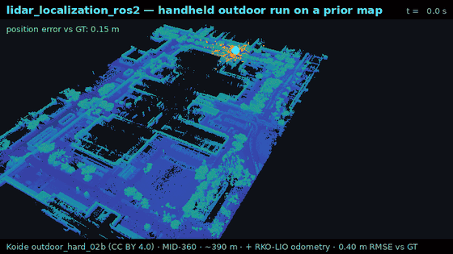

<div align="center">

<h1>lidar_localization_ros2</h1>

<p><strong>Map-based 3D LiDAR localization for ROS 2 and Nav2.</strong></p>

<p>
  <a href="https://github.com/rsasaki0109/lidar_localization_ros2/actions/workflows/main.yml">
    
  </a>
  
  
  
</p>



<p><em>Handheld Livox MID-360, ~390 m outdoors on a prior map, including stretches where the scans no longer match the map and a section outside it. Localization fused with RKO-LIO odometry stays within 0.26 m RMSE of the ground truth for the whole run (<a href="https://zenodo.org/records/10122133">Koide Hard Point Cloud Localization Dataset</a> <code>outdoor_hard_02b</code>, CC BY 4.0). <a href="./docs/readme-media.md">How this was made</a>.</em></p>

<p><a href="./docs/koide_gif_gallery.md">Explore the complete Koide indoor/outdoor GIF gallery →</a></p>

</div>

## Features

- NDT/GICP localization against `.pcd` and `.ply` maps
- standalone, Nav2, and Livox MID-360 launch configurations
- odometry/IMU prediction, scan deskew, diagnostics, and guarded recovery
- occupancy-map generation and a reproducible public-data run ([README run](docs/readme-media.md))

ROS 2 Jazzy with NDT_OMP is the recommended starting point. Continuous-time deskew is
enabled by default and safely leaves scans unchanged until point timing and motion data
are ready. Guarded global initialization is enabled automatically when quickstart is
given a matching occupancy map. See [v1 status](docs/v1_status.md) for validated scope
and limitations.

## Install

```bash
mkdir -p ~/lidarloc_ws/src
cd ~/lidarloc_ws/src
git clone https://github.com/rsasaki0109/lidar_localization_ros2.git
cd lidar_localization_ros2
scripts/bootstrap_colcon_workspace.sh --build
source ~/lidarloc_ws/install/setup.bash
```

The first build compiles `ndt_omp_ros2` and this package (about 30 minutes on an 8-core
machine).

For manual builds and no-sudo setup, see [local build](docs/local_build.md).

## Quick Start

Start localization and RViz with one command, once the sensors (and odometry, if any)
are running:

```bash
ros2 run lidar_localization_ros2 quickstart.py --map /absolute/path/to/map.pcd
```

Quickstart detects the sensor topics, `/clock`, an `odom -> base` odometry TF, and the
LiDAR frame, and prints them on its `Discovery:` line. It generates a reusable
configuration, restores only a pose saved against the same map, and verifies tracking.
Without a pose it runs guarded global initialization with 3D NDT scoring over an
occupancy grid generated from the map (or pass your own with `--occupancy-map`).
`--help` lists the options a bringup may need; `--help-all` adds the tuning ones.

On a [lidar_slam_ros2](https://github.com/rsasaki0109/lidar_slam_ros2) map with a Livox
MID-360, start its RKO-LIO odometry first
([details](docs/quickstart.md#localizing-on-a-lidar_slam_ros2-map)):

```bash
ros2 launch lidarslam rko_lio_odometry.launch.py
ros2 run lidar_localization_ros2 quickstart.py --map /path/to/output/my_map/map.pcd
```

For a Nav2 robot with the MID-360 preset:

```bash
ros2 run lidar_localization_ros2 quickstart.py \
  --profile mid360 \
  --map /absolute/path/to/map.pcd
```

Replays of the recorded mapping run (route-crop selects poses by time; outside the
recorded session, G2 falls back to the occupancy grid):

```bash
ros2 run lidar_localization_ros2 quickstart.py \
  --profile mid360 \
  --map /absolute/path/to/map.pcd \
  --reference-csv /absolute/path/to/mapping_run/reference.csv
```

To build a grid yourself, use
`ros2 run lidar_localization_ros2 generate_occupancy_map_from_pcd --pcd map.pcd --output-dir maps`.
Candidates are scored at the map's ground under them plus 1.0 m. If the sensor sits much
higher or lower, pass its height above the ground with `--sensor-height`, or one fixed
map-frame z with `--global-seed-z`; candidates scored at the wrong height are rejected
as weak.
If no safe candidate is available, it asks for **2D Pose Estimate** in RViz; it never
guesses the origin. See [quickstart and automatic initialization](docs/quickstart.md)
and the [repeat-route site setup](docs/site_setup.md) guide.
Use `--no-auto-initialize` to disable saved-pose restoration and global initialization,
or launch with `use_continuous_time_deskew:=false` to disable deskew.

Common launches:

```bash
# Standalone localization
ros2 launch lidar_localization_ros2 nav2_lidar_localization.launch.py

# Nav2
ros2 launch lidar_localization_ros2 nav2_navigation.launch.py \
  map_yaml:=/absolute/path/to/map.yaml

# Livox MID-360
ros2 launch lidar_localization_ros2 mid360_legged_localization.launch.py \
  map_path:=/absolute/path/to/map.pcd \
  cloud_topic:=/livox/points imu_topic:=/livox/imu
```

With `lidar_localization.launch.py` and `mid360_legged_localization.launch.py`, the
parameter YAML (`localization_param_dir:=...`) is the source of truth: frame, IMU,
deskew, map and initial-pose arguments override it only when you pass them, and the
static TF publishers use the same resolved `base_frame_id` as the node.

Check topics, TF, pose output, and diagnostics with:

```bash
ros2 run lidar_localization_ros2 check_lidar_localization_bringup.py \
  --profile standalone
```

## Runtime Contract

The default frames are `map`, `odom`, and `base_link`.

- `/initialpose` is expressed in `map`.
- Standalone mode publishes `map -> base_link`.
- Nav2 mode publishes `map -> odom` and requires an external `odom -> base_link`.
- `use_odom: true` consumes `/odom`; it does not publish odometry TF.
- Static LiDAR and IMU transforms must have only one publisher.

Main inputs are `/cloud`, `/initialpose`, `/odom`, and `/imu`. Main outputs are
`/pcl_pose`, `/path`, `/alignment_status`, and `/reinitialization_requested`. All
topic names are configurable. See [frame contract](docs/frame_contract.md) and
[troubleshooting](docs/troubleshooting.md) for details.

Nav2 additionally requires a 2D occupancy map and an `odom -> base_link` source.

## Reproduce the README Run

The run at the top of this page uses only public data (Koide Hard Point Cloud
Localization Dataset, `outdoor_hard_02b`) and the launch files above.
[How this was made](docs/readme-media.md) lists the odometry, TF bag, parameters and
launch command needed to replay it and check the 0.26 m result.

## Documentation

- [Validated scope](docs/v1_status.md)
- [Frames](docs/frame_contract.md) and [troubleshooting](docs/troubleshooting.md)
- [Benchmark: quickstart replays scored against ground truth](docs/benchmark.md) and the
  [earlier benchmarking record](docs/benchmarking.md)
- [MID-360 bringup](docs/mid360_legged_jetson.md)
- [IMU estimation](docs/imu_estimation.md) and [pose covariance](docs/pose_covariance.md)
- [Global localization](docs/global_localization.md)
- [Quickstart and automatic initialization](docs/quickstart.md)
- [Koide demo gallery](docs/koide_gif_gallery.md)
- [Release notes](CHANGELOG.md)

## Support

ROS 2 Jazzy is the primary target; Humble remains supported for existing deployments.
[ndt_omp_ros2](https://github.com/rsasaki0109/ndt_omp_ros2) is required and
[small_gicp](https://github.com/koide3/small_gicp) is optional.

### Lifecycle startup

The standalone, Nav2 localization and MID-360 launch files activate the localizer
through `GetState`/`ChangeState` services, without relying on transition events.
The startup helper exits once the node is active; it does not monitor or restart
the localizer afterward. Callback failure, unexpected state or a 60-second wall
clock deadline produces an error and a nonzero helper exit. An already active
node is left unchanged. For direct use, `ros2 run lidar_localization_ros2
start_lifecycle_node.py <node_name> --timeout <seconds>` accepts a relative node
name in the helper's ROS namespace.
