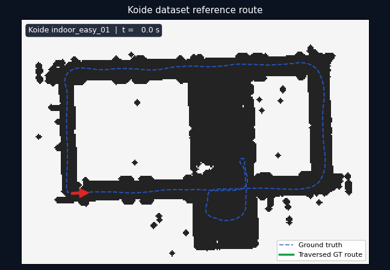
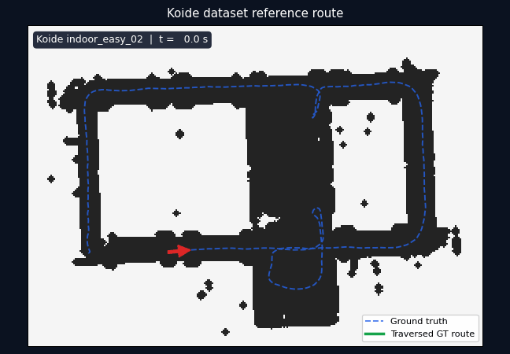
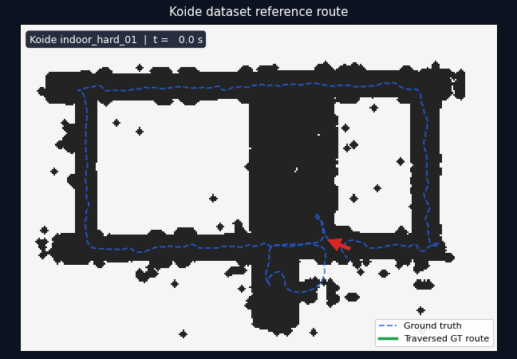
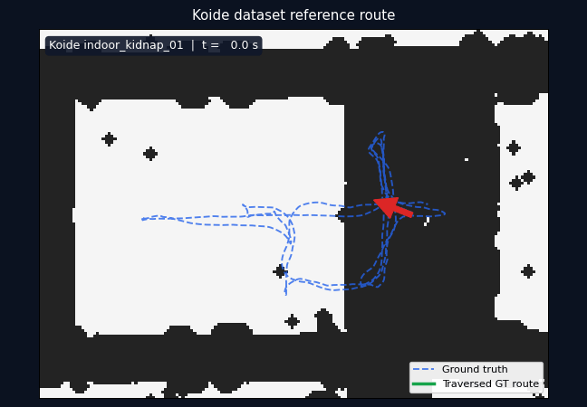
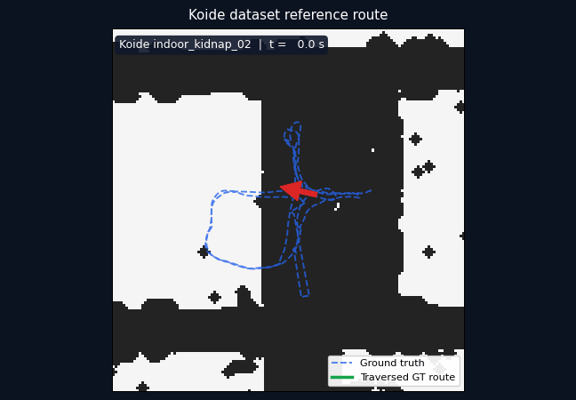
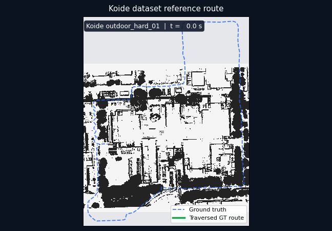
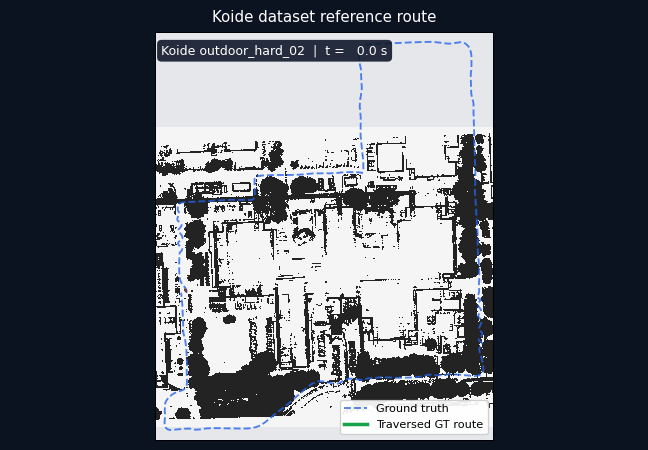
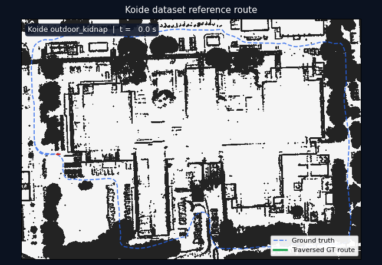

# Koide Dataset GIF Gallery

This page covers every reference trajectory in the
[Hard Point Cloud Localization Dataset](https://zenodo.org/records/10122133).
The route-overview GIFs animate published ground truth; they are dataset previews,
not localization accuracy results. Measured localization replays are listed separately.

## Dataset coverage

The publication provides eight reference trajectories in eleven downloadable ROS 2 bag
parts. Outdoor recordings are split into `a` and `b` archives while sharing one continuous
reference trajectory.

| Reference trajectory | ROS 2 bag archive(s) | Environment |
|---|---|---|
| `indoor_easy_01` | `indoor_easy_01` | Indoor |
| `indoor_easy_02` | `indoor_easy_02` | Indoor |
| `indoor_hard_01` | `indoor_hard_01` | Indoor |
| `indoor_kidnap_01` | `indoor_kidnap_01` | Indoor, kidnapped |
| `indoor_kidnap_02` | `indoor_kidnap_02` | Indoor, kidnapped |
| `outdoor_hard_01` | `outdoor_hard_01a`, `outdoor_hard_01b` | Outdoor |
| `outdoor_hard_02` | `outdoor_hard_02a`, `outdoor_hard_02b` | Outdoor |
| `outdoor_kidnap` | `outdoor_kidnap_a`, `outdoor_kidnap_b` | Outdoor, kidnapped |

## Indoor routes

### Indoor easy 01



### Indoor easy 02



### Indoor hard 01



### Indoor kidnap 01



### Indoor kidnap 02



## Outdoor routes

### Outdoor hard 01



### Outdoor hard 02



### Outdoor kidnap



## Measured localization replays

### Full-sequence GLIM external-LIO replays (2026-07-19)

These are full-bag measurements of the recovery architecture, not route previews or
30-second smoke tests. GLIM supplies live `odom -> base_link`; NDT supplies the map
anchor. While NDT rejects a scan, the last accepted `map -> odom` anchor is frozen and
re-stamped, and the published `/pcl_pose` is composed from that anchor and live GLIM
odometry. The G3 supervisor tries the same composed pose before any BBS global search.
The GLIM configuration uses the exact quadratic coreset (size 32) and one worker thread.

The two coverage columns deliberately measure different things:

- **Output coverage** is the fraction of alignment scan times covered by the public
  `/pcl_pose` stream. It includes accepted NDT poses and odom-bridge poses.
- **NDT matched** is the fraction of alignment scans accepted by NDT. A low value does
  not mean missing output: it shows how much of the sequence the bridge had to carry.

| Bag | Duration | Translation RMSE | Max / final error | Output coverage | NDT matched | Max output gap | Gate |
|---|---:|---:|---:|---:|---:|---:|---|
| `outdoor_hard_01a` | 380 s | 0.772 m | 3.230 / 0.487 m | 100.0% | 24.8% | 0.601 s | Pass |
| `outdoor_hard_01b` | 302 s | 0.699 m | 2.096 / 0.221 m | 100.0% | 48.8% | 0.700 s | Pass |
| `outdoor_hard_02a` | 363 s | 0.708 m | 1.949 / 0.195 m | 100.0% | 23.5% | 0.700 s | Pass |
| `outdoor_hard_02b` | 298 s | 0.655 m | 2.307 / 0.193 m | 100.0% | 63.0% | 0.751 s | Pass |

The gate requires output coverage >=99%, translation RMSE <=2.0 m, and maximum output
gap <=1.0 s. All processes returned zero; false recovery confirmation, BBS reset,
reset loops, NaN, crashes, and TF-parent conflicts were zero. The aspirational targets
of 0.5 m RMSE and 95% NDT matched coverage remain open. For repeatability,
`outdoor_hard_01a` was run three times: RMSE was 0.772--0.952 m, final error was
0.475--0.495 m, and all three runs passed the output gates.

In the GIFs, the teal line is the complete public `/pcl_pose` stream. Green dots are
NDT-accepted scans, amber dots are odom-bridge output during rejection, and red dots
are odom-bridge output while reinitialization is also requested. The blue dashed line
is ground truth. Run-level metrics are loaded directly from `trajectory_eval.json` and
`bridge_coverage.json` when rendering; they are not typed into the image by hand.

#### Outdoor hard 01a — full sequence

Representative repeat 3 of 3; the long red and amber spans remain covered by the
external-LIO bridge.


#### Outdoor hard 01b — full sequence


#### Outdoor hard 02a — full sequence


#### Outdoor hard 02b — full sequence


#### Outdoor hard 02b — recovery and safe re-attachment

This crop starts at `t=175 s`. It includes the reinitialization-request interval and the
natural NDT re-attachment at `t=264.0 s`. The request latch clears only after five
consecutive accepted samples with fitness <=1.0 and translation correction <=0.5 m.
The qualifying samples tightened from fitness 0.937 to 0.561 with 0.014--0.064 m
corrections; `/pcl_pose` remained continuous throughout.


### 30-second NDT baseline (2026-07-17)

These GIFs are generated from recorded `/pcl_pose`, not copied from ground truth. Each
run covers the first 30 seconds of its bag, except `outdoor_kidnap_a`, which starts at
`+0.6 s` so the published ground truth overlaps the replay. Indoor runs are LiDAR-only;
outdoor runs use scan-bounded dual-queue IMU preintegration with the correction guard
and `imu_accel_scale: 9.80665` (the Koide Livox bags publish acceleration in g).

The table below is the earlier 2026-07-17 measurement on a quiet machine. It uses the
package's internal motion model rather than the GLIM external-LIO architecture above.
Two earlier defects
were fixed before it: the IMU acceleration unit/variance bugs (dual-queue
preintegration work) and a missing `imu_accel_scale` in the generated benchmark
manifests. The 2026-07-13 artifacts are archived next to the current runs
(`runs_20260713/`). Coverage is the accepted-pose time span over the 30 s window; a
low coverage means the estimator stopped publishing rather than tracked badly.

This is a short-window engineering check, not a full-sequence benchmark. Local
diagnostics cannot prove accuracy: `indoor_kidnap_01` locks onto a wrong,
locally-self-consistent match (map aliasing) that only ground truth reveals.

| Bag | Mode | Matched poses | Coverage | Translation RMSE | Rotation RMSE | Result |
|---|---|---:|---:|---:|---:|---|
| `indoor_easy_01` | LiDAR | 315 | 94.3% | 0.061 m | 1.46 deg | Bounded |
| `indoor_easy_02` | LiDAR | 342 | 92.9% | 0.127 m | 1.25 deg | Bounded |
| `indoor_hard_01` | LiDAR | 289 | 93.3% | 5.444 m | 131.08 deg | Failed |
| `indoor_kidnap_01` | LiDAR | 52 | 15.6% | 7.237 m | 115.92 deg | Aliased |
| `indoor_kidnap_02` | LiDAR | 223 | 66.2% | 8.624 m | 119.07 deg | Failed |
| `outdoor_hard_01a` | LiDAR + IMU | 93 | 90.0% | 0.198 m | 0.99 deg | Bounded |
| `outdoor_hard_01b` | LiDAR + IMU | 84 | 91.7% | 0.668 m | 23.31 deg | Degraded |
| `outdoor_hard_02a` | LiDAR + IMU | 91 | 91.0% | 0.181 m | 0.97 deg | Bounded |
| `outdoor_hard_02b` | LiDAR + IMU | 101 | 92.3% | 0.243 m | 1.06 deg | Bounded |
| `outdoor_kidnap_a` | LiDAR + IMU | 97 | 93.7% | 0.209 m | 0.58 deg | Bounded |
| `outdoor_kidnap_b` | LiDAR + IMU | 106 | 91.7% | 0.271 m | 0.73 deg | Bounded |

Versus the 2026-07-13 measurement, the IMU fixes repaired every outdoor failure mode
but one: `outdoor_hard_01a` 0.400 m/48 poses -> 0.198 m/93 poses, `outdoor_hard_02a`
14 poses (83% of the window unscored) -> 91 poses, `outdoor_hard_02b` 1.593 m/12.0 deg
-> 0.243 m/1.06 deg, `outdoor_kidnap_b` 0.569 m/5.1 deg -> 0.271 m/0.73 deg.
`outdoor_hard_01b` improved (1.347 m/28.6 deg -> 0.668 m/23.3 deg) but still has one
late rotation-divergence event with the error growing at the window end. The indoor
hard/kidnap failures are unchanged and tracked separately: sparse deskew-incapable
depth-camera scans (~100 filtered points) destabilize NDT on `indoor_hard_01` /
`indoor_kidnap_02`, and `indoor_kidnap_01` needs global verification, not local
tuning. `indoor_easy_02` showed one transient bad run during the sweep (archived as
`runs/indoor_easy_02_outlier_run1`); the tabulated rerun matches its historical
behavior.

### Indoor easy 01 measured


### Indoor easy 02 measured


### Indoor hard 01 measured


### Indoor kidnap 01 measured


### Indoor kidnap 02 measured


### Outdoor hard 01a measured


### Outdoor hard 01b measured


### Outdoor hard 02a measured


### Outdoor hard 02b measured


### Outdoor kidnap a measured


### Outdoor kidnap b measured


## Reproduce the route gallery

Keep the large maps, bags, generated occupancy maps, and reference CSV files outside the
repository. For example, with the dataset on an external SSD:

```bash
scripts/render_koide_dataset_gallery.sh \
  --data-dir /media/sasaki/aiueo/datasets/koide_hard_localization
```

Prepare the measured 30-second benchmark manifests after sourcing ROS 2:

```bash
python3 scripts/prepare_koide_localization_gif_benchmarks.py \
  --data-dir /media/sasaki/aiueo/datasets/koide_hard_localization \
  --output-root /media/sasaki/aiueo/datasets/koide_hard_localization/generated/localization_gif_benchmarks
```

Render a full-sequence GLIM run from its recorded benchmark artifacts. This example is
the 02b replay; substitute the corresponding run and reference paths for 01a/01b/02a:

```bash
DATA=/media/sasaki/aiueo/datasets/koide_hard_localization
RUN=/tmp/glimfrontend_runs/outdoor_hard_02b_coreset_latch_clear_run04

python3 scripts/render_koide_localization_gif.py \
  --occupancy-yaml "$DATA/generated/gif_gallery/occupancy/outdoor_hard/map.yaml" \
  --estimated-csv "$RUN/pose_trace.csv" \
  --alignment-csv "$RUN/alignment_status.csv" \
  --reference-csv \
    "$DATA/generated/localization_gif_benchmarks/assets/outdoor_hard_02b_reference.csv" \
  --trajectory-eval-json "$RUN/trajectory_eval.json" \
  --bridge-coverage-json "$RUN/bridge_coverage.json" \
  --output-gif images/koide/measured/glim_frontend/outdoor_hard_02b_full.gif \
  --frames 72 --fps 9 \
  --sequence-label "Koide outdoor_hard_02b (full 298 s)" \
  --estimate-label "Published /pcl_pose" \
  --title "GLIM external LIO + NDT map localization"
```

Add `--start-offset-sec 175 --duration-sec 123` for the 02b recovery crop. Full-sequence
GIFs use 72 frames; the recovery crop and legacy gallery use 64. All are 648 x 450. The
red arrow is derived from trajectory motion, including a minimum spatial baseline at
stops and trajectory endpoints, so it represents direction of travel rather than the
sensor quaternion.

Dataset citation: Kenji Koide, *Hard Point Cloud Localization Dataset*, Zenodo, 2023,
<https://doi.org/10.5281/zenodo.10122133>. Dataset files are distributed under CC BY 4.0.
