# Koide Measured Localization Gallery

This page presents measured localization replays from the
[Hard Point Cloud Localization Dataset](https://zenodo.org/records/10122133).
Ground truth appears only as a reference overlay in each replay; standalone animated
ground-truth routes are intentionally omitted because they do not demonstrate localization
accuracy or recovery behavior.

## Measured localization replays

### GLIL-style prior-map localization replay (2026-07-19)

This is the first full live replay of the GLIL-style split: GLIM supplies continuous
LiDAR/IMU `odom -> base_link`, while sparse prior-map VGICP registrations update only a
smoothed `map -> odom`. It does **not** run NDT alongside GLIM. Direct VGICP is the
normal submap-rate tracker; KISS-Matcher runs only as an acquisition or recovery
fallback. Rejected localization therefore freezes the last map anchor instead of
interrupting or deforming GLIM odometry.

| Bag | Front end | Coverage | Translation ATE | Final error | Median 10 m RPE | Rotation ATE | Processing p95 | Gate |
|---|---|---:|---:|---:|---:|---:|---:|---|
| `outdoor_hard_01a` | GLIM exact coreset 32 + sparse VGICP | 99.21% | 1.142 m | 3.112 m | 0.157 m | 1.479 deg | 28.3 ms | Pass |
| `outdoor_hard_01b` | GLIM exact coreset 32 + sparse VGICP | 99.04% | 1.539 m | 2.055 m | 0.191 m | 1.598 deg | 53.8 ms | Pass |
| `outdoor_hard_02a` baseline repeat 1 | GLIM exact coreset 32 + sparse VGICP | 99.15% | 2.059 m | 3.078 m | 0.180 m | 1.676 deg | 35.8 ms | ATE fail |
| `outdoor_hard_02a` baseline repeat 2 | GLIM exact coreset 32 + sparse VGICP | 99.15% | 2.023 m | 3.049 m | 0.183 m | 1.715 deg | 37.2 ms | ATE fail |
| `outdoor_hard_02a` Z-bridge repeat 1 | GLIM exact coreset 32 + sparse VGICP | 99.15% | 1.926 m | 2.854 m | 0.181 m | 1.683 deg | 38.5 ms | Pass |
| `outdoor_hard_02a` Z-bridge repeat 2 | GLIM exact coreset 32 + sparse VGICP | 99.15% | 1.795 m | 2.827 m | 0.181 m | 1.703 deg | 30.4 ms | Pass |
| `outdoor_hard_02b` | GLIM exact coreset 32 + sparse VGICP | 99.03% | 0.908 m | 1.412 m | 0.177 m | 1.765 deg | 47.9 ms | Pass |

The startup yaw is fixed, accepted translation displacement uses gain 0.2, and GLIM
ROS applies a 2 s first-order transition. All four sequences retained at least 99%
output coverage, and every run had zero TF jumps and zero unauthorized resets. Direct
and KISS fallback candidates were rejected once they stopped satisfying the gates; the
frozen map correction plus live odometry carried the remaining output.

The original `outdoor_hard_02a` policy failed only the 2.0 m ATE gate in two repeats.
Its submap-30 prior-map candidate was good enough to enter two-submap recovery consensus,
but freezing Z while waiting moved the next submap away from the prior-map surface. The
Z-bridge variant keeps XY and yaw frozen while applying the candidate's vertical
map-to-odom correction. It passed two new full repeats at 1.926 m and 1.795 m ATE with
zero TF jumps and zero unauthorized resets. This is opt-in with vertical gain 1.0; the
default remains backward compatible. The published ground-vehicle gate planarizes Z.
A separate non-planar check of repeat 2 improved from the earlier 10.4--10.7 m range to
9.21 m ATE but still failed, so full 3D drift and kidnapped-pose recovery remain open.
Ground truth is only the dashed evaluation overlay.

#### Four-bag Z-bridge regression

Vertical gain 1.0 was subsequently replayed across all four outdoor-hard bags with the
same image and unchanged gates. It passed at least once on every bag, but remains opt-in
because one of two 01b repeats exceeded the ATE limit.

| Bag | Repeat | Translation ATE | Final error | Median 10 m RPE | Processing p95 | Gate |
|---|---:|---:|---:|---:|---:|---|
| `outdoor_hard_01a` | 1 | 1.106 m | 2.738 m | 0.160 m | 60.3 ms | Pass |
| `outdoor_hard_01b` | 1 | 2.219 m | 2.412 m | 0.183 m | 78.3 ms | ATE fail |
| `outdoor_hard_01b` | 2 | 1.867 m | 2.022 m | 0.192 m | 94.1 ms | Pass |
| `outdoor_hard_02a` | 1 | 1.926 m | 2.854 m | 0.181 m | 38.5 ms | Pass |
| `outdoor_hard_02a` | 2 | 1.795 m | 2.827 m | 0.181 m | 30.4 ms | Pass |
| `outdoor_hard_02b` | 1 | 1.097 m | 1.538 m | 0.175 m | 81.4 ms | Pass |

Cross-composing the 01b artifacts isolated the failure: repeat-1 raw GLIM odometry with
the baseline map anchor still produced 2.210 m ATE, while baseline raw odometry with the
repeat-1 Z-bridge anchor produced 1.562 m. The anchor changed ATE by only about 0.02 m;
the failed repeat was dominated by raw-odometry variability. This clears the Z bridge of
a direct 01b regression, but one-pass-per-bag evidence is not sufficient to enable it by
default.

The raw-odometry variance was then isolated to parallel ordering in random-grid
preprocessing and the odometry optimizer. With both coreset-profile thread counts fixed
to one, two new full 01b replays produced byte-identical 2,218-row `odom_lidar.txt`
files (SHA-256 `45d49d87932febc06b4ab18b29fc1ba58fc6f6ed043a7157523fe4e75f383642`).
Both passed at 1.407079 m ATE and 1.957 m final error; RPE was 0.18690/0.18694 m and
processing p95 was 44.3/47.5 ms. Sparse prior-map VGICP still varied its Z anchor by up
to 4.3 cm, but the resulting planar ATE difference was below 0.000001 m. The vertical
bridge remains opt-in until this deterministic profile is replayed on the other bags and
the non-planar drift is resolved.

#### Outdoor hard 01a

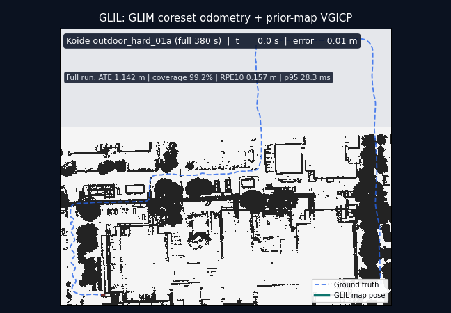

#### Outdoor hard 01b

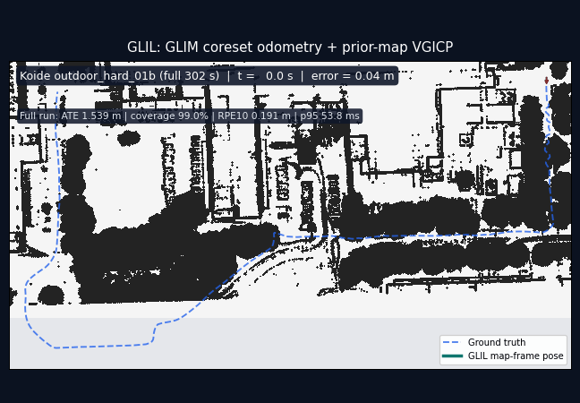

#### Outdoor hard 02a — Z-bridge repeat 2, all planar gates passed

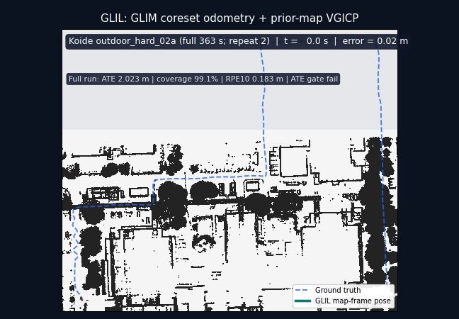

#### Outdoor hard 02b

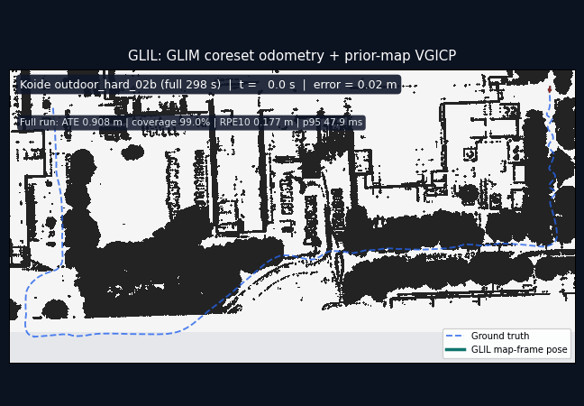

### Full-sequence GLIM external-LIO replays (2026-07-19)

These are full-bag measurements of the recovery architecture, not route previews or
30-second smoke tests. GLIM supplies live `odom -> base_link`; NDT supplies the map
anchor. While NDT rejects a scan, the last accepted `map -> odom` anchor is frozen and
re-stamped, and the published `/pcl_pose` is composed from that anchor and live GLIM
odometry. The G3 supervisor tries the same composed pose before any BBS global search.
The GLIM configuration uses the exact quadratic coreset (size 32) and one worker thread.

The two coverage columns deliberately measure different things:

- **Output coverage** is the fraction of alignment scan times covered by the public
  `/pcl_pose` stream. It includes accepted NDT poses and odom-bridge poses.
- **NDT matched** is the fraction of alignment scans accepted by NDT. A low value does
  not mean missing output: it shows how much of the sequence the bridge had to carry.

| Bag | Duration | Translation RMSE | Max / final error | Output coverage | NDT matched | Max output gap | Gate |
|---|---:|---:|---:|---:|---:|---:|---|
| `outdoor_hard_01a` | 380 s | 0.772 m | 3.230 / 0.487 m | 100.0% | 24.8% | 0.601 s | Pass |
| `outdoor_hard_01b` | 302 s | 0.699 m | 2.096 / 0.221 m | 100.0% | 48.8% | 0.700 s | Pass |
| `outdoor_hard_02a` | 363 s | 0.708 m | 1.949 / 0.195 m | 100.0% | 23.5% | 0.700 s | Pass |
| `outdoor_hard_02b` | 298 s | 0.655 m | 2.307 / 0.193 m | 100.0% | 63.0% | 0.751 s | Pass |

The gate requires output coverage >=99%, translation RMSE <=2.0 m, and maximum output
gap <=1.0 s. All processes returned zero; false recovery confirmation, BBS reset,
reset loops, NaN, crashes, and TF-parent conflicts were zero. The aspirational targets
of 0.5 m RMSE and 95% NDT matched coverage remain open. For repeatability,
`outdoor_hard_01a` was run three times: RMSE was 0.772--0.952 m, final error was
0.475--0.495 m, and all three runs passed the output gates.

In the GIFs, the teal line is the complete public `/pcl_pose` stream. Green dots are
NDT-accepted scans, amber dots are odom-bridge output during rejection, and red dots
are odom-bridge output while reinitialization is also requested. The blue dashed line
is ground truth. Run-level metrics are loaded directly from `trajectory_eval.json` and
`bridge_coverage.json` when rendering; they are not typed into the image by hand.

#### Outdoor hard 01a — full sequence

Representative repeat 3 of 3; the long red and amber spans remain covered by the
external-LIO bridge.

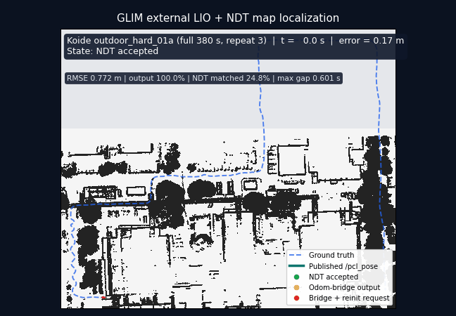

#### Outdoor hard 01b — full sequence

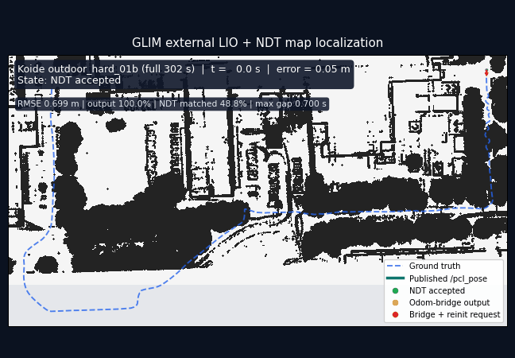

#### Outdoor hard 02a — full sequence

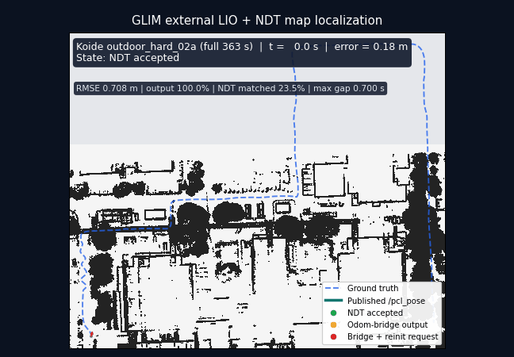

#### Outdoor hard 02b — full sequence

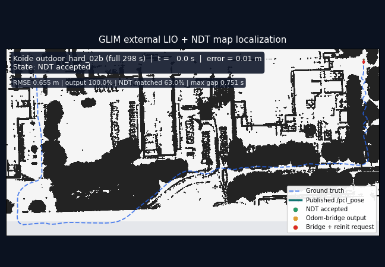

#### Outdoor hard 02b — recovery and safe re-attachment

This crop starts at `t=175 s`. It includes the reinitialization-request interval and the
natural NDT re-attachment at `t=264.0 s`. The request latch clears only after five
consecutive accepted samples with fitness <=1.0 and translation correction <=0.5 m.
The qualifying samples tightened from fitness 0.937 to 0.561 with 0.014--0.064 m
corrections; `/pcl_pose` remained continuous throughout.

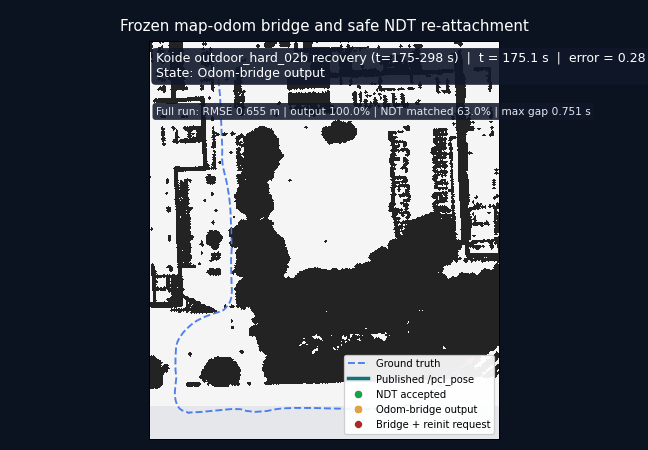

### 30-second NDT baseline (2026-07-17)

These GIFs are generated from recorded `/pcl_pose`, not copied from ground truth. Each
run covers the first 30 seconds of its bag, except `outdoor_kidnap_a`, which starts at
`+0.6 s` so the published ground truth overlaps the replay. Indoor runs are LiDAR-only;
outdoor runs use scan-bounded dual-queue IMU preintegration with the correction guard
and `imu_accel_scale: 9.80665` (the Koide Livox bags publish acceleration in g).

The table below is the earlier 2026-07-17 measurement on a quiet machine. It uses the
package's internal motion model rather than the GLIM external-LIO architecture above.
Two earlier defects
were fixed before it: the IMU acceleration unit/variance bugs (dual-queue
preintegration work) and a missing `imu_accel_scale` in the generated benchmark
manifests. The 2026-07-13 artifacts are archived next to the current runs
(`runs_20260713/`). Coverage is the accepted-pose time span over the 30 s window; a
low coverage means the estimator stopped publishing rather than tracked badly.

This is a short-window engineering check, not a full-sequence benchmark. Local
diagnostics cannot prove accuracy: `indoor_kidnap_01` locks onto a wrong,
locally-self-consistent match (map aliasing) that only ground truth reveals.

| Bag | Mode | Matched poses | Coverage | Translation RMSE | Rotation RMSE | Result |
|---|---|---:|---:|---:|---:|---|
| `indoor_easy_01` | LiDAR | 315 | 94.3% | 0.061 m | 1.46 deg | Bounded |
| `indoor_easy_02` | LiDAR | 342 | 92.9% | 0.127 m | 1.25 deg | Bounded |
| `indoor_hard_01` | LiDAR | 289 | 93.3% | 5.444 m | 131.08 deg | Failed |
| `indoor_kidnap_01` | LiDAR | 52 | 15.6% | 7.237 m | 115.92 deg | Aliased |
| `indoor_kidnap_02` | LiDAR | 223 | 66.2% | 8.624 m | 119.07 deg | Failed |
| `outdoor_hard_01a` | LiDAR + IMU | 93 | 90.0% | 0.198 m | 0.99 deg | Bounded |
| `outdoor_hard_01b` | LiDAR + IMU | 84 | 91.7% | 0.668 m | 23.31 deg | Degraded |
| `outdoor_hard_02a` | LiDAR + IMU | 91 | 91.0% | 0.181 m | 0.97 deg | Bounded |
| `outdoor_hard_02b` | LiDAR + IMU | 101 | 92.3% | 0.243 m | 1.06 deg | Bounded |
| `outdoor_kidnap_a` | LiDAR + IMU | 97 | 93.7% | 0.209 m | 0.58 deg | Bounded |
| `outdoor_kidnap_b` | LiDAR + IMU | 106 | 91.7% | 0.271 m | 0.73 deg | Bounded |

Versus the 2026-07-13 measurement, the IMU fixes repaired every outdoor failure mode
but one: `outdoor_hard_01a` 0.400 m/48 poses -> 0.198 m/93 poses, `outdoor_hard_02a`
14 poses (83% of the window unscored) -> 91 poses, `outdoor_hard_02b` 1.593 m/12.0 deg
-> 0.243 m/1.06 deg, `outdoor_kidnap_b` 0.569 m/5.1 deg -> 0.271 m/0.73 deg.
`outdoor_hard_01b` improved (1.347 m/28.6 deg -> 0.668 m/23.3 deg) but still has one
late rotation-divergence event with the error growing at the window end. The indoor
hard/kidnap failures are unchanged and tracked separately: sparse deskew-incapable
depth-camera scans (~100 filtered points) destabilize NDT on `indoor_hard_01` /
`indoor_kidnap_02`, and `indoor_kidnap_01` needs global verification, not local
tuning. `indoor_easy_02` showed one transient bad run during the sweep (archived as
`runs/indoor_easy_02_outlier_run1`); the tabulated rerun matches its historical
behavior.

### Indoor easy 01 measured

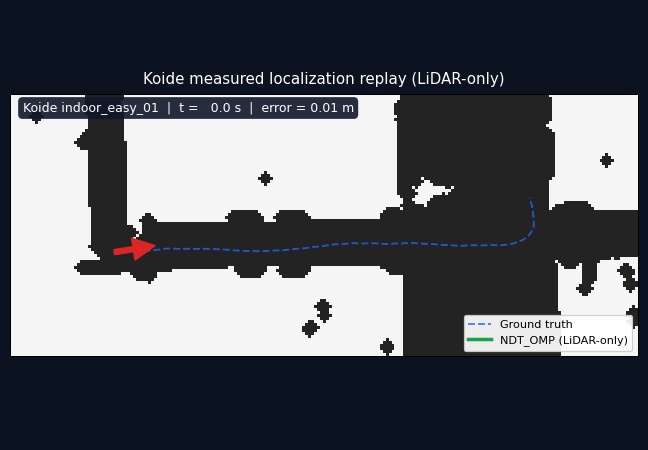

### Indoor easy 02 measured

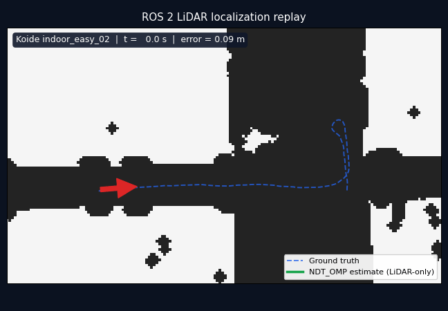

### Indoor hard 01 measured

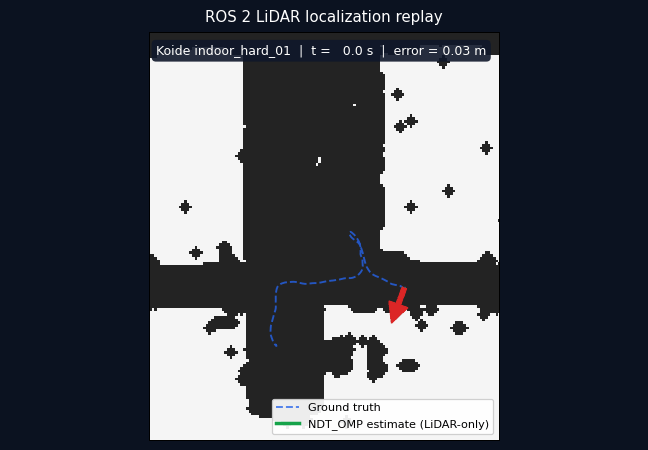

### Indoor kidnap 01 measured

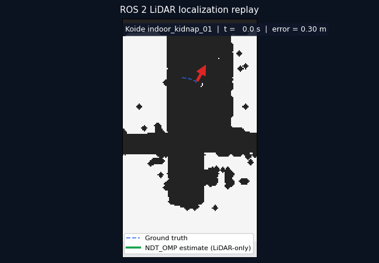

### Indoor kidnap 02 measured

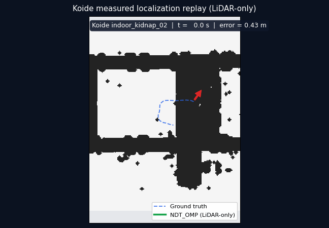

### Outdoor hard 01a measured

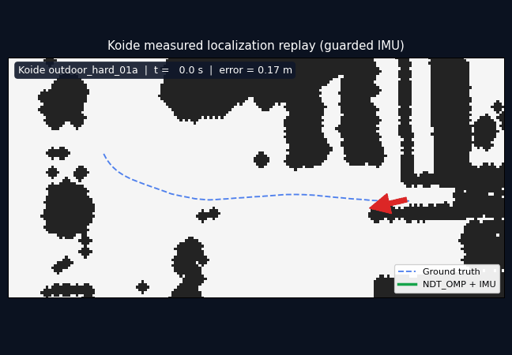

### Outdoor hard 01b measured

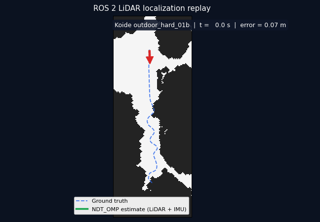

### Outdoor hard 02a measured

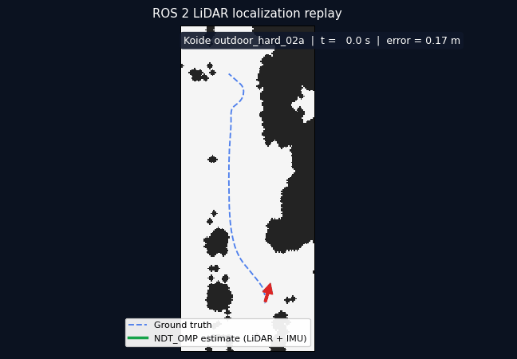

### Outdoor hard 02b measured

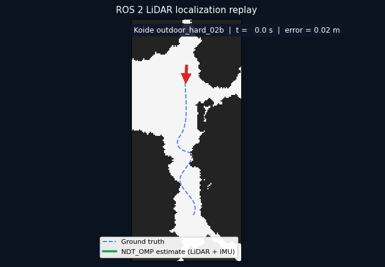

### Outdoor kidnap a measured

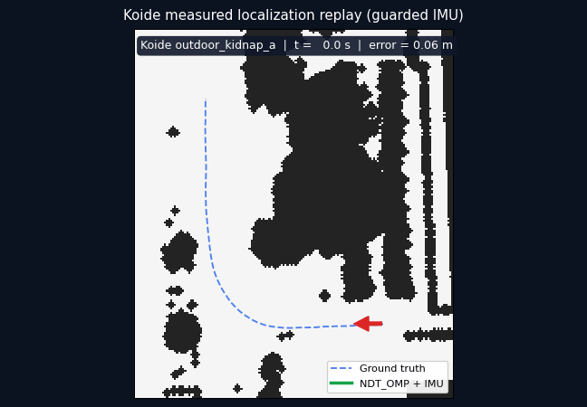

### Outdoor kidnap b measured

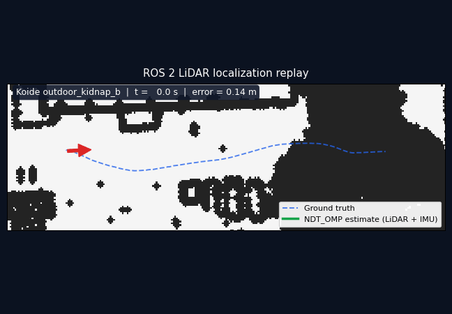

## Dataset reference

The publication provides eight reference trajectories in eleven downloadable ROS 2 bag
parts. Outdoor recordings are split into `a` and `b` archives while sharing one continuous
reference trajectory.

| Reference trajectory | ROS 2 bag archive(s) | Environment |
|---|---|---|
| `indoor_easy_01` | `indoor_easy_01` | Indoor |
| `indoor_easy_02` | `indoor_easy_02` | Indoor |
| `indoor_hard_01` | `indoor_hard_01` | Indoor |
| `indoor_kidnap_01` | `indoor_kidnap_01` | Indoor, kidnapped |
| `indoor_kidnap_02` | `indoor_kidnap_02` | Indoor, kidnapped |
| `outdoor_hard_01` | `outdoor_hard_01a`, `outdoor_hard_01b` | Outdoor |
| `outdoor_hard_02` | `outdoor_hard_02a`, `outdoor_hard_02b` | Outdoor |
| `outdoor_kidnap` | `outdoor_kidnap_a`, `outdoor_kidnap_b` | Outdoor, kidnapped |

## Reproduce measured replays

Keep the large maps, bags, generated occupancy maps, and reference CSV files outside the
repository.

Prepare the measured 30-second benchmark manifests after sourcing ROS 2:

```bash
python3 scripts/prepare_koide_localization_gif_benchmarks.py \
  --data-dir /media/sasaki/aiueo/datasets/koide_hard_localization \
  --output-root /media/sasaki/aiueo/datasets/koide_hard_localization/generated/localization_gif_benchmarks
```

The GLIL-style full runs used these startup crop seeds. They are approximate runtime
initialization inputs, not evaluator ground truth:

| Bag | X | Y | Z | Yaw |
|---|---:|---:|---:|---:|
| `outdoor_hard_01a` | -86.040205 | -8.857126 | -11.043077 | -82.0063 deg |
| `outdoor_hard_01b` | 103.703859 | -3.360581 | -11.276523 | -3.0042 deg |
| `outdoor_hard_02a` | -104.343538 | -10.324673 | -11.620099 | 163.3613 deg |
| `outdoor_hard_02b` | 103.616685 | -1.693832 | -11.022091 | 4.4813 deg |

This example reproduces and renders 01a. Substitute the sequence, duration, output,
reference, seed, and metric label for the other rows:

```bash
DATA=/media/sasaki/aiueo/datasets/koide_hard_localization
RUN=/tmp/glil_outdoor_hard_01a

python3 scripts/run_koide_glim_odometry_benchmark.py \
  --bag "$DATA/sequences/outdoor_hard_01a" \
  --reference "$DATA/benchmark/outdoor_hard_01a/reference.csv" \
  --prior-map "$DATA/map_outdoor_hard.ply" \
  --prior-map-bootstrap-center -86.040205 -8.857126 -11.043077 \
  --prior-map-bootstrap-yaw-deg -82.0063 \
  --config param/odometry/glim_koide_outdoor_gicp6500_coreset \
  --image lidarloc/glim-ros2:jazzy-v1.2.2-live-map-odom \
  --output "$RUN"

python3 scripts/render_koide_localization_gif.py \
  --occupancy-yaml "$DATA/generated/gif_gallery/occupancy/outdoor_hard/map.yaml" \
  --estimated-csv "$RUN/pose_trace.csv" \
  --reference-csv \
    "$DATA/generated/localization_gif_benchmarks/assets/outdoor_hard_01a_reference.csv" \
  --output-gif images/koide/measured/glil/outdoor_hard_01a_live_map_odom.gif \
  --frames 72 --fps 9 \
  --sequence-label "Koide outdoor_hard_01a (full 380 s)" \
  --estimate-label "GLIL map-frame pose" \
  --title "GLIL: GLIM coreset odometry + prior-map VGICP" \
  --metrics-label \
    "Full run: ATE 1.142 m | coverage 99.2% | RPE10 0.157 m | p95 28.3 ms"
```

For the measured 02a Z-bridge repeats, add
`--prior-map-vertical-gain 1.0`; this follows Z during a global-consensus pending
candidate without accepting its XY or yaw correction.

Render a full-sequence GLIM run from its recorded benchmark artifacts. This example is
the 02b replay; substitute the corresponding run and reference paths for 01a/01b/02a:

```bash
DATA=/media/sasaki/aiueo/datasets/koide_hard_localization
RUN=/tmp/glimfrontend_runs/outdoor_hard_02b_coreset_latch_clear_run04

python3 scripts/render_koide_localization_gif.py \
  --occupancy-yaml "$DATA/generated/gif_gallery/occupancy/outdoor_hard/map.yaml" \
  --estimated-csv "$RUN/pose_trace.csv" \
  --alignment-csv "$RUN/alignment_status.csv" \
  --reference-csv \
    "$DATA/generated/localization_gif_benchmarks/assets/outdoor_hard_02b_reference.csv" \
  --trajectory-eval-json "$RUN/trajectory_eval.json" \
  --bridge-coverage-json "$RUN/bridge_coverage.json" \
  --output-gif images/koide/measured/glim_frontend/outdoor_hard_02b_full.gif \
  --frames 72 --fps 9 \
  --sequence-label "Koide outdoor_hard_02b (full 298 s)" \
  --estimate-label "Published /pcl_pose" \
  --title "GLIM external LIO + NDT map localization"
```

Add `--start-offset-sec 175 --duration-sec 123` for the 02b recovery crop. Full-sequence
GIFs use 72 frames; the recovery crop and legacy gallery use 64. All are 648 x 450. The
red arrow is derived from trajectory motion, including a minimum spatial baseline at
stops and trajectory endpoints, so it represents direction of travel rather than the
sensor quaternion.

Dataset citation: Kenji Koide, *Hard Point Cloud Localization Dataset*, Zenodo, 2023,
<https://doi.org/10.5281/zenodo.10122133>. Dataset files are distributed under CC BY 4.0.
